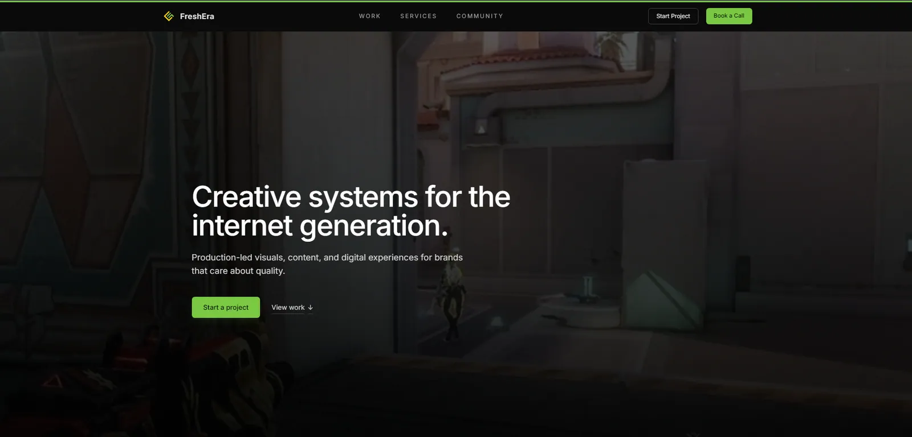
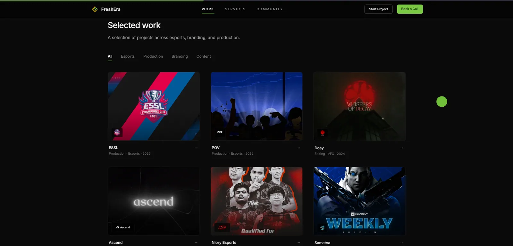
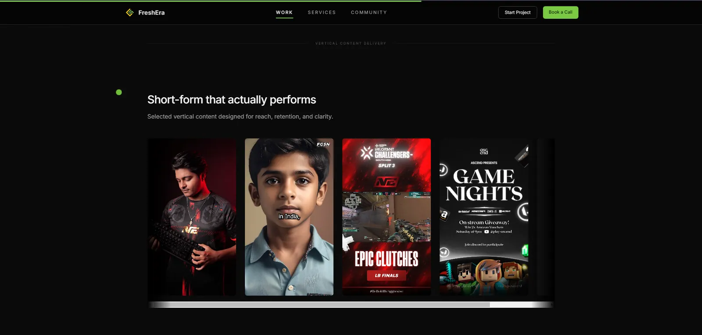
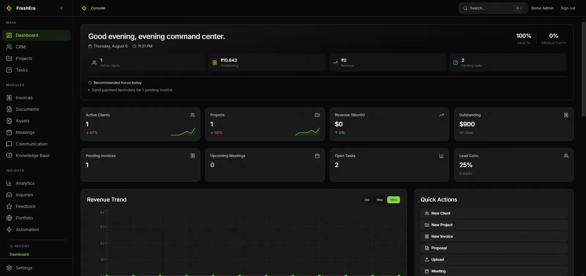
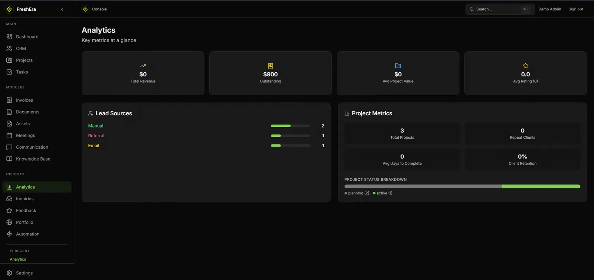
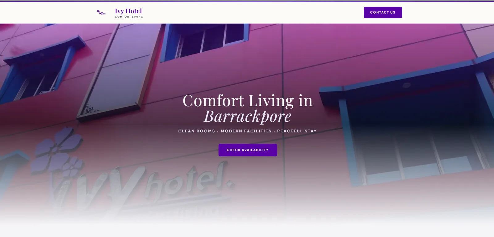
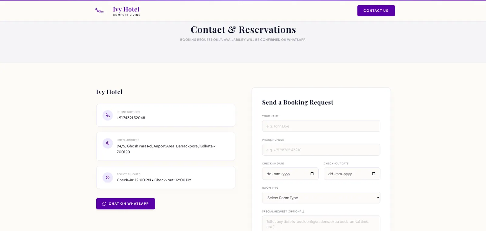

# Niraj Agarwal — Portfolio

A single-page, client-rendered portfolio built with **React 19**, **Vite 8**, **TypeScript**, **Framer Motion**, and **Tailwind CSS**. Its centerpiece is an interactive 3D "Mirror Cube" that reacts to scroll, hover, and device tilt.

  **·**    **·**    **·**  

> Reverse-engineered documentation set. Content describes what the code does, and known issues are recorded **without** being fixed. See [Known Limitations](#known-limitations).

---

## Contents

- [Overview](#overview)
- [Tech Stack and Why](#tech-stack-and-why)
- [Quick Start](#quick-start)
- [Project Structure](#project-structure)
- [Features](#features)
- [Screenshots](#screenshots)
- [Architecture](#architecture)
- [Performance](#performance)
- [Security](#security)
- [Known Limitations](#known-limitations)
- [Roadmap](#roadmap)
- [FAQ](#faq)
- [License](#license)

---

## Overview

The site presents **one person's product/software/design work** through seven stacked sections: Hero (with the Mirror Cube), The Builder, Selected Work, Current Chapter, Tools of Choice, Beyond The Screen, and Contact.

**What it is:**

- **Fully static.** A single `index.html` shell + hashed assets. No backend, no API, no database, no router, no SSR.
- **Client-rendered (CSR).** `main.tsx` calls `createRoot(...).render(...)`; React (under `<StrictMode>`) paints each section.
- **Content-as-data.** Projects, timeline, and brand lists are typed objects in `src/data/`. Adding a project is a data change, not a component change.
- **One global state.** `CubeProvider` (context) is the single piece of shared state. Every section publishes events; the Mirror Cube consumes them.
- **Video-first previews.** Project walkthroughs are muted, looped WebM videos that only play when in view.

**What it is not:** there is **no backend, no database, no API, and no login**. All copy and media are committed in the repo. External requests are limited to **Google Fonts** (via `<link>` in `index.html`) and **Simple Icons CDN logos** (`cdn.simpleicons.org`) in the Tools section.

### Version table

| Concern | Version | Evidence |
|---|---|---|
| React / react-dom | **19.2.4** | `package.json` dependencies |
| TypeScript | ~6.x (devDependency) | `package.json` |
| Vite | **8** (devDependency) | `package.json` |
| Tailwind CSS | **4** (devDependency) | `package.json` |
| Framer Motion | **12.38.0** | `package.json` |
| ESLint | 9 (flat config) | `eslint.config.js` |

---

## Tech Stack and Why

| Tool | Role |
|---|---|
| **React 19 + TS** | Type-safe UI; `StrictMode` double-render catches side effects in dev. |
| **Framer Motion** | Reveal animations, `AnimatePresence` for modal enter/exit, spring values for the cube. |
| **CSS custom properties** | `src/index.css` is the design system (~1,950 lines): colors, spacing, fonts, easing, and all section styles. |
| **Tailwind 4** | Present in config, but nearly all styling is hand-written CSS. Currently a minimal surface. |
| **Vite 8** | Dev server + Rollup bundling. `build` = `tsc -b && vite build` (type-check gates the build). |
| **ESLint 9** | Flat config: `eslint.config.js` with typescript-eslint, react-hooks, react-refresh. |

Three runtime dependencies (`react`, `react-dom`, `framer-motion`), 15 devDependencies.

---

## Quick Start

```bash
# 1. Install
npm install

# 2. Dev server (http://localhost:5173)
npm run dev

# 3. Type-check + production build into dist/
npm run build

# 4. Preview the production build
npm run preview

# 5. Lint
npm run lint
```

> Strictly, run `npm install` inside the repo root. Node `>=20` is assumed (Vite 8).

Required Node engine: not pinned in `package.json` — Vite 8 requires Node 20.19+ / 22.12+. Verify with `node -v` if the dev server errors.

---

## Project Structure

```text
niraj-portfolio/
├── index.html                  # Entry HTML + fonts + <title>NIRAJ...</title>
├── vite.config.ts              # Vite config (react plugin only)
├── tsconfig.app.json / node.json / tsconfig.json   # Project references
├── tailwind.config.js          # Content globs; theme empty
├── postcss.config.js           # @tailwindcss/postcss + autoprefixer
├── eslint.config.js            # Flat config
├── public/                     # Static assets copied to dist/
│   ├── *.webm                  # Project walkthroughs (VP9 videos)
│   ├── *.webp                  # Screenshots / video posters
│   ├── favicon.svg
│   └── icons.svg
├── src/
│   ├── main.tsx                # React root, StrictMode
│   ├── App.tsx                 # Composition root, header, mobile drawer, footer
│   ├── index.css               # Entire design system + section styles
│   ├── App.css                 # Intentionally empty (per comment)
│   ├── components/             # 13 components incl. CubeController, MirrorCube, Hero
│   ├── sections/Work.tsx       # Selected Work + modal
│   ├── data/                   # portfolio.ts, timeline.ts, brands.ts
│   ├── types/index.ts          # Shared types (Project, Timeline, etc.)
│   └── assets/                 # UNUSED template leftovers
└── docs/                       # This documentation set
```

Full details: **[docs/architecture.md](docs/architecture.md)** (structure, data flow, build pipeline, key decisions, debt).

---

## Features

| # | Feature | Try it |
|---|---|---|
| 1 | Hero + interactive **Mirror Cube** (drag, click, gyro) | Scroll the page — the cube re-orients to each section and to hovered projects |
| 2 | Section-aware nav indicators | Auto-highlight as you scroll |
| 3 | The Builder — 3 principles | Scroll to reveal |
| 4 | Selected Work — 5 projects, 2 groups | Hover the cards; the hero cube reacts |
| 5 | Video previews on scroll | Cards autoplay their WebM walkthrough when in view |
| 6 | Project modal (focus trap, Esc, click-out) | Click any project card |
| 7 | Lightbox gallery | Click a thumbnail inside a modal |
| 8 | Tools of Choice (Simple Icons logos) | Scroll to TechStack section |
| 9 | Current Chapter timeline | Scroll to Timeline |
| 10 | Beyond The Screen | Scroll to the closing section |

Deep dive per feature: **[docs/features.md](docs/features.md)**.

---

## Screenshots

All media below are copies of the files in [`public/`](public/), used verbatim as the project's own previews. They are the canonical visuals, so screenshots point at the exact artifacts the site renders.

### Freshera Studio

<video src="docs/screenshots/freshera-studio.webm" controls poster="docs/screenshots/freshera-studio-1.webp" width="720"></video>

| | | |
|---|---|---|
|  |  |  |

### Freshera Console

<video src="docs/screenshots/freshera-console.webm" controls poster="docs/screenshots/freshera-console-1.webp" width="720"></video>

| | |
|---|---|
|  |  |

### Ivy Hotel

<video src="docs/screenshots/ivy-hotel.webm" controls poster="docs/screenshots/ivy-hotel-1.webp" width="720"></video>

| | |
|---|---|
|  |  |

> Any assets (Poster) that appear as a black frame — for example the freshera-console poster — simply reflect that the file is a video poster without an embedded thumbnail; the file itself plays normally.

---

## Architecture

Three layers: **data** (`src/data/*` typed objects) → **state** (`CubeProvider`) → **presentation** (components + Framer Motion). The cube consumes [global state](circle) published by the page; page components never touch cube internals.

A Mermaid diagram, the component tree, the exact state flow, the request-and-build pipelines, and the folder map with the decision log and debt are in **[docs/architecture.md](docs/architecture.md)**.

---

## Performance

A quick summary of measured bundle and ranked bottlenecks.

| metric | value |
|---|---|
| `dist/index-*.js` | 356.8 KB |
| `dist/index-*.css` | 27.3 KB |
| `index.html` | 1.1 KB |
| Videos (`public/*.webm`) | ~9.6 MB total |

Methodology, the ranked list of improvements, and step-by-step fixes are in **[docs/performance.md](docs/performance.md)**.

---

## Security

Static site: verified **no** `dangerouslySetInnerHTML`, no `process.env` / `import.meta.env`, no network calls from app code, no `localStorage`. Attack surface is limited to third-party CDNs (fonts, icons) and any future deployments.

Threat model + CSP/headers recommendations: **[docs/security.md](docs/security.md)**.

---

## Known Limitations

Recorded, **not** fixed (documented by design; use the files below to address them):

1. **Broken link** — `/resume.pdf` is referenced in the Contact section (and header), but no such file exists in `public/`. The link 404s. Fix: add the file or remove the href.
2. **Copy mismatch** — The hero/About says "I've shipped **six** products", but `src/data/portfolio.ts` contains **five** projects (2 Enterprise AI, 3 Commercial).
3. **Encoding mojibake** — Files `src/data/portfolio.ts` and `src/index.css` contain mis-decoded text like `â€"` (mojibake for an em-dash byte sequence). It appears mostly in comments; verify in affected lines before editing.
4. **Unused assets** — `src/assets/` (template leftovers) and a 2.8 MB `src/original-*.mp4` are unused. git status also shows `CommercialEngagementCard.tsx` and `EnterpriseCaseCard.tsx` staged for deletion (an in-progress redesign).
5. **No tests / CI** — There is no test suite and no CI workflow. Only `tsc -b` and `eslint` gate the build.

6. **Docs gap** — there is no `docs/issues.md`; suggested fixes live in the issue template of [docs/contributing.md](docs/contributing.md).

---

## Roadmap

| Area | Idea | Status |
|---|---|---|
| Content | Replace "Six products" copy with the real count | documented |
| Link | Add real `resume.pdf` or remove broken references | not done |
| App | Fix mis-encoded em-dash mojibake in .ts/.css | not started |
| Perf | Code-split below-the-fold sections | not started |
| Dev | Add test framework (Vitest + Testing Library) + CI | not started |

---

## FAQ

**Do I need a backend?** No. The site is fully static. Deploy `dist/` to any CDN/static host.

**How do I add a project?** Add an entry to `src/data/portfolio.ts`; see [docs/features.md](docs/features.md) → the "Adding a project" pattern, and types in `src/types/index.ts`.

**Why is the cube a "Mirror Cube"?** The idea (from source comments): it reflects the environment; mirrored inner faces are a product/brand metaphor. It rotates with spring-lerp physics, slice-turns on click, and auto-rotates after ~30 s idle.

**Does it work on mobile?** Yes — touch drag, plus tilt control via the deviceorientation API (iOS requires a tap first to grant permission).

**What hosts it?** The repo config has no deployment CI. The running site's references to `vercel` are inferred — confirm against the actual hosting account.

---

## License

The layout and component code are provided as a reference. All person/project content (name, roles, product screenshots) belongs to Niraj Agarwal. This README is not legal advice — see `LICENSE` in the repo if present.

For the full documentation suite: **[docs/](docs/)** — architecture, features, API, database, deployment, contributing, performance, and security.