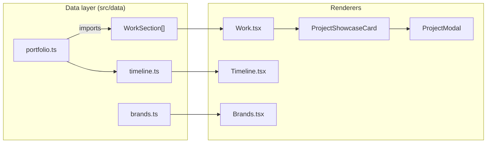

# API

> TL;DR — **This project has zero backend, zero API layer, and zero network endpoints of its own.** Every byte of content is statically compiled at build time. This document explains exactly what a "data/API" layer means *in this codebase* — the typed data modules that act as the content contract consumed by components.

- [Backend Endpoints](#backend-endpoints)
- [The Content API (Data Layer)](#the-content-api-data-layer)
- [Typed Contract (Project Content)](#typed-contract-project-content)
- [External Integrations](#external-integrations)
- [Error Contract](#error-contract)
- [Future Backend Considerations](#future-backend-considerations)

---

## Backend Endpoints

| Method | URL | Purpose | Auth |
|---|---|---|---|
| — | — | None exist | n/a |

There is no `express`, `node:http`, serverless function, or edge function anywhere in the repo. All requests terminate at the static host. The only HTTP traffic is:

1. `GET /` → `index.html`
2. `GET /assets/*.{js,css}` → the compiled bundle
3. `GET /<public-file>` → media, favicon, resume (see failure notes)
4. Third-party: Google Fonts, Simple Icons CDN (`cdn.simpleicons.org`)

---

## The Content API (Data Layer)

In lieu of a server, **`src/data/*` is the content API**. Components import these typed modules and render from them. There is no run-time fetch, no caching layer, and no hydration — the contract is enforced at compile time by TypeScript.

### Content modules

| Module | Shape | Action |
|---|---|---|
| `src/data/portfolio.ts` | `WorkSection[]` | Projects grouped by category — the primary content source |
| `src/data/timeline.ts` | `TimelineItem[]` | Career chapter narrative |
| `src/data/brands.ts` | `Record<string, Brand>` | Simple Icons slug + hex color lookup |

### Flow diagram



---

## Typed Contract (Project Content)

The `Project` type in `src/types/index.ts` is the schema every card, modal and cube maps to:

```ts
type Project = {
  id: string;          // stable id
  name: string;        // title / URL shown in browser frame
  client: string;      // company monogram/logos
  category: "enterprise-ai" | "commercial-products";
  badge: string;       // pill text
  statusLabel: string; // "Live" | "Internal Product"
  description: string; description
  overview: string;    // modal overview
  note?: string;
  role: string;        // "Lead Engineer" etc.
  date: string;
  tech: string[];      // resolved to logo pills
  features: { title: string; text: string }[];
  stats: { value: string; label: string }[];
  architecture?: string[];  // flows row → chip → chip
  preview: Visual | ProjectVideo;   // media/branded/video
  gallery: (Visual | ProjectVideo)[];
  actionPrimary: { label; type: "link"|"modal"; href? };
  actionSecondary?: { ... };
};
```

### Media shape

```ts
type Visual = { type: "media"; src: string } | { type: "branded" };
type ProjectVideo = { type: "video"; src: string; poster?: string };
```

`ProjectVisual.tsx` is the renderer switch: `branded` → `BrandedTile`, `video` → `<video>`, `media` → ``. A single project can mix types (e.g. gallery starts with images and ends with a video).

**Authoring a project = editing one object** in `portfolio.ts` + adding media to `public/`. No component change required — the entire showcase, modal, gallery, stats and cube hover offset are derived.

---

## External Integrations

| Service | Endpoint | Used for | Failure mode |
|---|---|---|---|
| Google Fonts | `https://fonts.googleapis.com` | Inter, Space Grotesk, JetBrains Mono | Falls back to system sans-serif |
| Simple Icons | `https://cdn.simpleicons.org/{slug}/{hex}` | Tech/company logos | `onError` → pill shows text only / monogram letter (see `Brands.tsx`) |
| GitHub / LinkedIn / Email / Resume | external hrefs | Contact section | Standard 404 of whatever falls |

None of these require API keys, tokens, or environment variables in this repo.

---

## Error Contract

Since there's no server, there are no error codes. The two controlled degradation paths are:

| Scenario | Behavior |
|---|--|
| Logo loads fail | `Brands.tsx` `onError` → `failed=true` → `` unmounted; text/monogram shown |
| Video can't play | `<video>` stays muted poster (`preload="metadata"`); play attempt is `.catch(() => {})` |

**No `fetch`, `axios`, `SWR`, or React Query is used.** Adding live data later would require introduction of an API layer (see Roadmap in [README](../README.md)).

---

## Future Backend Considerations

If the site grows needs (contact form, CMS, analytics), the natural next step is a serverless layer (Vercel Functions / Next.js route handlers) that keeps the SPA static but adds endpoints for `POST /api/contact` etc., with:

- request validation (zod) on the server
- rate limiting (contact spam)
- server-side env vars only (`*.local` git-ignored)

> Next: [Database](database.md) · [Back to README](../README.md)