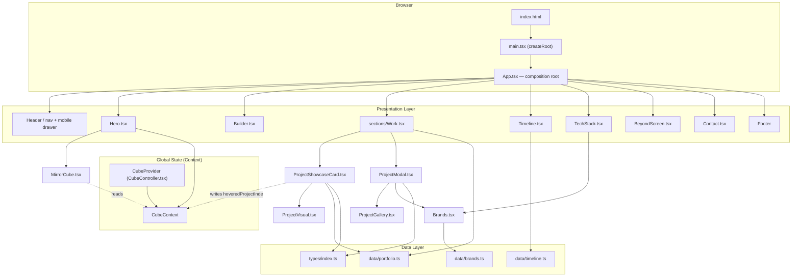
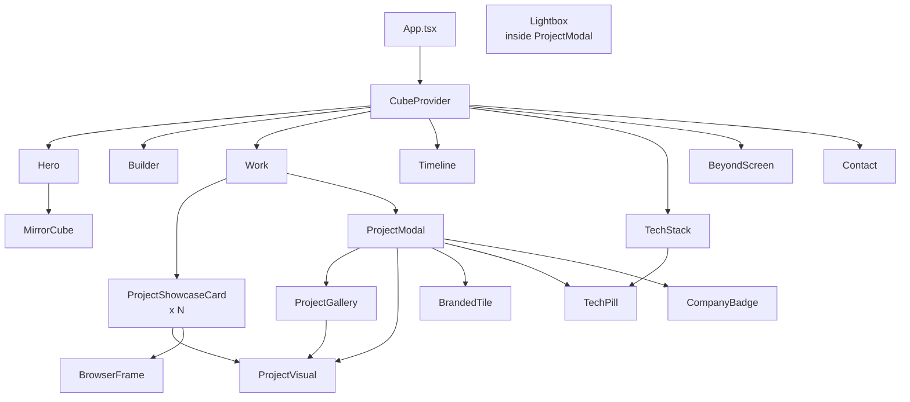
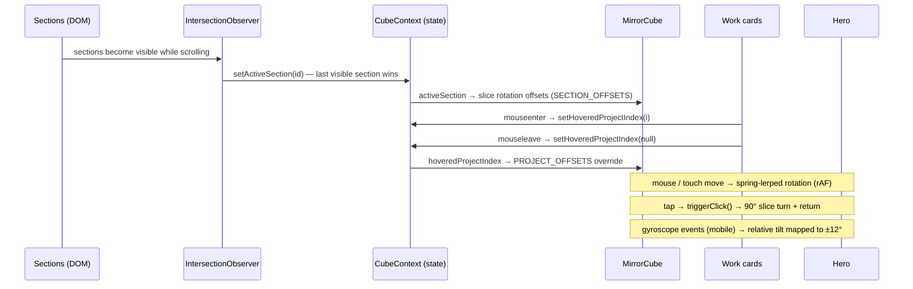
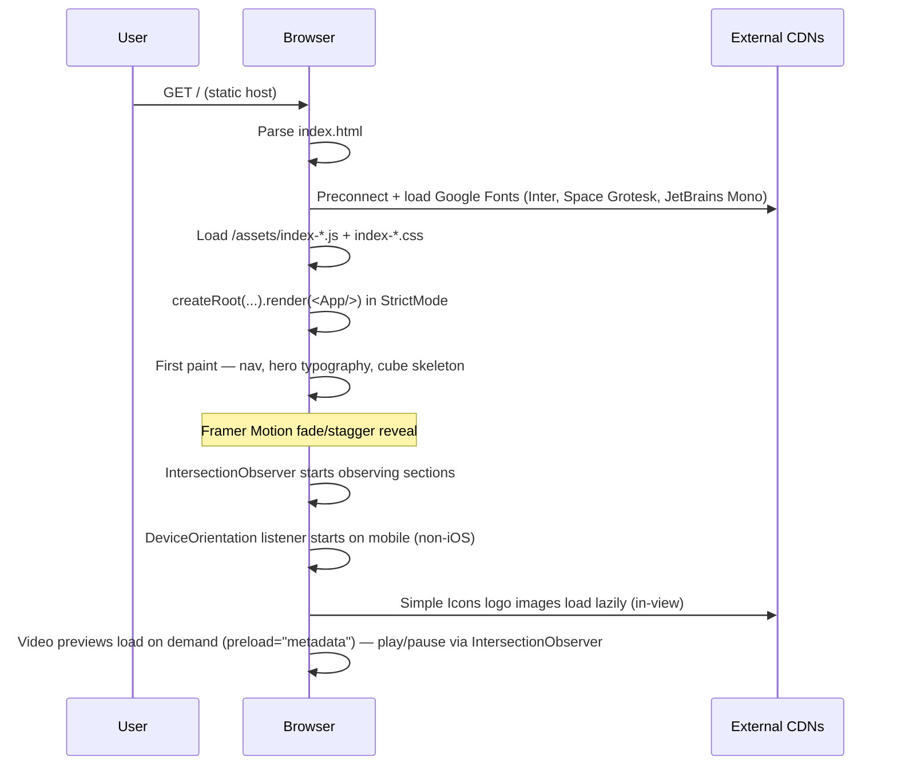
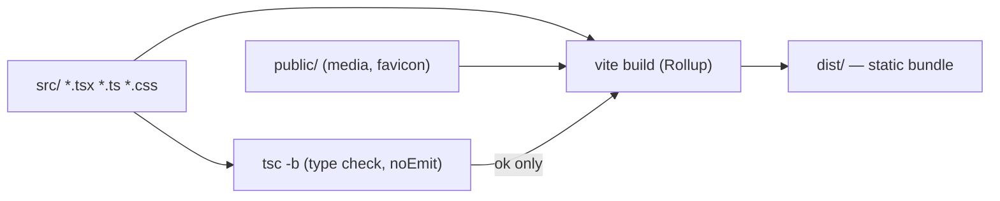

# Architecture

This document describes how the Niraj portfolio website is structured, how data flows through it, and the reasoning behind the design. Everything here is inferred directly from the repository source code.

- [Overview](#overview)
- [High-Level Architecture](#high-level-architecture)
- [Component Hierarchy](#component-hierarchy)
- [State Flow (CubeController)](#state-flow-cubecontroller)
- [Request / Render Lifecycle](#request-render-lifecycle)
- [Build Pipeline](#build-pipeline)
- [Folder Structure](#folder-structure)
- [Key Architectural Decisions](#key-architectural-decisions)
- [Known Architectural Debt](#known-architectural-debt)

---

## Overview

The project is a **single-page, static, client-rendered (CSR) React application**. There is no backend, no router, and no server-side rendering. One `index.html` entry point loads a bundle that renders seven stacked sections inside `<main>`, separated by horizontal dividers.

The architecture has three layers:

| Layer | Responsibility | Location |
|---|---|---|
| **Data layer** | Typed, hand-curated content (projects, timeline, brand slugs) | `src/data/`, `src/types/` |
| **State layer** | Global "shared awareness" context that coordinates the interactive 3D cube with page scroll, project hover and device tilt | `src/components/CubeController.tsx` |
| **Presentation layer** | Sections, cards, modals, galleries and the cube itself — driven by Framer Motion | `src/components/`, `src/sections/`, `src/index.css` |

The site is content-addressable: adding a project is a data edit in `src/data/portfolio.ts`, not a component change.

---

## High-Level Architecture



### Dependency direction

Data types (`src/types/`) are imported by the data modules and by every component that renders project content. Components never import from each other's data files — content always flows through `src/data/*`.

---

## Component Hierarchy



Notes:

- `ProjectVisual.tsx` is a **union renderer**: it accepts a `Visual | ProjectVideo` and renders either a `BrandedTile`, a `<video>` or an ``. It also exports the `BrowserFrame` and `BrandedTile` presentational helpers.
- `Brands.tsx` renders **external logo images** from the Simple Icons CDN, with graceful fallbacks (nothing / monogram letter) when a brand slug is missing or the network request fails.
- The modal is only mounted while a project is selected (`AnimatePresence` around `{selected && <ProjectModal/>}` in `Work.tsx`).

---

## State Flow (CubeController)

The site has exactly one piece of global state: the cube context. Everything else is local component state.



State properties exposed by `CubeProvider`:

| Property | Type | Writer | Consumer |
|---|---|---|---|
| `activeSection` | `"hero" \| "builder" \| ...` | IntersectionObserver inside provider | `MirrorCube` (section offsets) |
| `hoveredProjectIndex` | `number \| null` | `ProjectShowcaseCard` mouseenter/leave | `MirrorCube` (per-project offsets) |
| `isHovered` | `boolean` | Hero cube wrapper | `MirrorCube` (hover intensity, lighting) |
| `isClicked` | `boolean` | Hero cube wrapper → `triggerClick()` | `MirrorCube` (click animation) |
| `gyroRotation` | `{ alpha, beta, gamma } \| null` | deviceorientation events | `MirrorCube` (mobile tilt) |
| `gyroAvailable` | `boolean` | provider (first valid reading) | `MirrorCube` |
| `requestGyroPermission` | `() => void` | Hero (user gesture) | iOS permission gate |

Design intent (from source comments): the cube is **decoupled from page-level scroll/hover logic**. Page components publish events; the cube only consumes state.

---

## Request / Render Lifecycle



No network round-trips to the application itself occur after the initial page load — the site is fully static.

---

## Build Pipeline



The `build` script is `tsc -b && vite build` — the TypeScript project references build (type-checks) **before** bundling, so a type error blocks the production build. `dist/` contains the hashed JS/CSS assets plus all files from `public/` copied verbatim.

---

## Folder Structure

```text
niraj-portfolio/
├── index.html                  # Entry HTML, fonts, metadata
├── vite.config.ts              # Vite config (react plugin only)
├── tsconfig*.json              # TypeScript project references (app + node)
├── tailwind.config.js          # Tailwind content globs (theme empty)
├── postcss.config.js           # @tailwindcss/postcss + autoprefixer
├── eslint.config.js            # Flat config: JS + TS + react-hooks + react-refresh
├── public/                     # Copied verbatim to dist/
│   ├── *.webm                  # Project walkthrough recordings (VP9)
│   ├── *.webp                  # Project screenshots / video posters
│   ├── favicon.svg
│   └── icons.svg
├── src/
│   ├── main.tsx                # React root (StrictMode)
│   ├── App.tsx                 # Composition root, nav, mobile drawer, footer
│   ├── index.css               # Design system (CSS custom properties) + all section styles
│   ├── App.css                 # Intentionally blank (per comment)
│   ├── components/
│   │   ├── CubeController.tsx  # Global context provider
│   │   ├── MirrorCube.tsx      # 3D CSS cube with spring physics
│   │   ├── Hero.tsx            # Hero + cube wiring
│   │   ├── Builder.tsx         # "The Builder" principles
│   │   ├── ProjectShowcaseCard.tsx  # Work list item + parallax + video-on-view
│   │   ├── ProjectVisual.tsx   # Union renderer (media/video/branded) + BrowserFrame/BrandedTile
│   │   ├── ProjectModal.tsx    # Dialog + focus trap + lightbox
│   │   ├── ProjectGallery.tsx  # Thumbnail gallery + lightbox trigger
│   │   ├── Brands.tsx          # Simple Icons logo rendering + TechPill + CompanyBadge
│   │   ├── Timeline.tsx        # "Current Chapter"
│   │   ├── TechStack.tsx       # "Tools of Choice"
│   │   ├── BeyondScreen.tsx    # "Beyond The Screen"
│   │   └── Contact.tsx         # Social links
│   ├── sections/
│   │   └── Work.tsx            # Selected Work (groups of showcase cards + modal)
│   ├── data/
│   │   ├── portfolio.ts        # Project content (the content API)
│   │   ├── timeline.ts         # Career chapter data
│   │   └── brands.ts           # Simple Icons slug → brand color map
│   ├── types/
│   │   └── index.ts            # All shared TypeScript types
│   └── assets/                 # Unused template leftovers (vite.svg, react.svg, hero.png)
└── dist/                       # Build output (git-ignored but present)
```

---

## Key Architectural Decisions

1. **One context, one provider.** Rather than prop-drilling seven interaction flags, `CubeProvider` publishes all cube interaction state. Consumers read what they need; the cube never owns page logic. (Inferred from the file's own header comment.)
2. **Content as typed data.** `src/data/portfolio.ts` is the single source of truth for projects; the `Project` type in `src/types/index.ts` is the contract. This keeps the presentation layer generic.
3. **CSS variables as the design system.** `src/index.css` defines the entire visual language (`--bg-primary`, `--accent`, `--font-*`, easing curves) using custom properties; components reference them inline or via classes. Tailwind is configured but the vast majority of styling is hand-written CSS.
4. **Physics in JS, rendering in CSS.** The cube interpolates rotation with a manual spring-lerp inside `useAnimationFrame` and applies it to `motion.div` transforms — framerate-independent and layout-thrash-free (transform-only animation).
5. **Media as video-first previews.** Project previews are muted, looping `.webm` walkthroughs that only play when ≥40% visible — a deliberate bandwidth/attention tradeoff.

---

## Known Architectural Debt

These are observations, not defects — recorded so future work is deliberate:

- **Repeated motion variants.** The `fadeUp` / `container` variant objects are duplicated verbatim in seven components. A shared `src/motion.ts` would remove the duplication.
- **Single bundle, no code splitting.** All sections ship in one ~357 KB JS file; lazy-loading below-the-fold sections would reduce initial parse cost.
- **Tailwind installed but mostly unused.** The theme is empty and nearly all styles are custom CSS; the Tailwind dependency currently adds config surface without much payoff.
- **Unused template assets** (`src/assets/vite.svg`, `react.svg`, `hero.png`) ship in the repo.
- **A stray 2.8 MB video** (`src/original-*.mp4`) sits in the source tree, unused (git status shows the same file deleted from `public/`).
- **No tests and no CI** — there is no verification gate beyond `tsc -b` and `eslint` running locally.
- **In-progress redesign.** The git index contains staged deletions of two legacy components (`CommercialEngagementCard.tsx`, `EnterpriseCaseCard.tsx`) and unstaged modifications — the working tree is ahead of `origin/main`.

> Next: [Features](features.md) · [Performance](performance.md) · [Back to README](../README.md)
