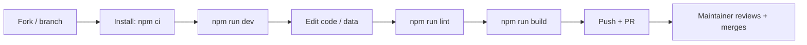

# Contributing

First — thank you for considering contributing to the Niraj portfolio. This is a single-person portfolio site, so the bar is "keep it simple and deliberate." This document sets out the workflow, branch strategy, commit conventions, code style, and how to report issues.

> **A note on scope.** This is a small, static, content-driven site. Most contributions will be **content edits** (`src/data/portfolio.ts`), **style tweaks** (`src/index.css`), or **Spot-fixes** to components. Before opening a large PR, open an issue first — the ergonomics of this site depend on restraint.

---

## Development Workflow



### Quickstart

```bash
npm ci            # clean install from lockfile
npm run dev       # Vite dev server (HMR), usually http://localhost:5173
npm run lint      # ESLint (flat config)
npm run build     # tsc -b type-check + vite build → dist/
npm run preview   # serve the production build
```

> There are **no tests** in this repo. The verification gate is `npm run lint` + `npm run build` (build runs type-check first).

---

## Branch Strategy

The repo uses a single long-lived branch, `main`, with GitHub as the canonical remote (`github.com/niraj-ag/niraj-agarwal`).

- Feature / fix / chore work happens on a **short-lived branch** off `main`.
- For a single-person project, branch-per-feature is optional but recommended for anything non-trivial so `main` stays deployable.
- Final merge is typically a clean merge commit or squash.

Suggested branch naming:

| Change type | Pattern | Example |
|---|---|---|
| Fix | `fix/` – `fix/parallax-overflow` | `fix/cube-gyro-ios` |
| Feature | `feat/` | `feat/add-blog-section` |
| Content | `content/` | `content/add-2026-project` |
| Docs | `docs/` | `docs/update-readme` |

---

## Commit Convention

Commits follow a **Conventional Commits**-style summary. Keep subject under ~70 chars.

| Prefix | Use for |
|---|---|
| `feat:` | new section, component, capability |
| `fix:` | bug fix |
| `perf:` | performance improvement |
| `refactor:` | restructure without behavior change |
| `docs:` | documentation (README, docs/*) |
| `chore:` | tooling, deps, build config |
| `content:` | data-layer edits (`src/data/*`) |

Examples from this repo's history to copy:

```
feat: phone gyro — cube reacts to device tilt
fix: cube color palette alignment
docs: expand README
```

---

## Code Style

Follow what the codebase already does — these rules keep the diff noisy low:

1. **TypeScript strict-ish.** Enforced by `tsconfig.app.json` (`noUnusedLocals`, `noUnusedParameters`, `verbatimModuleSyntax`). Use `import type { X }` for type-only imports.
2. **React idioms.** Function components, named exports for the default component, inline `variants` objects for Framer Motion. Keep components under ~120 lines where possible; split children.
3. **Styling.** Add styles as CSS custom-property-driven rules in `src/index.css` — don't inline arbitrary pixels.** Reuse design tokens (`--bg-surface`, `--accent`, `--ease-out` etc.) rather than hardcoding colors.
4. **Data edits.** Content lives in `src/data/*.ts`; types live in `src/types/index.ts`. Media files go in `public/` (referenced as `/file`).

### Before you submit, you must:

```bash
npm run lint  # exit 0
npm run build # type-check + bundle succeed
```

Do **not** commit `dist/` (git-ignored), node_modules, or local env files.

---

## Pull Requests

- Base: `main`. One logical change per PR.
- Include a **screenshot** for anything visual, and paste it into the PR or link a `docs/screenshots/` asset.
- Describe the **intent of the change** and, if it touches the cube/interaction, which motion primitive was used.
- Self-review your diff via `git diff` before pushing.

### PR checklist

- [ ] `npm run lint` passes
- [ ] `npm run build` passes
- [ ] Screenshots attached for UI changes
- [ ] Docs touched (if applicable)

---

## Issue Reporting

- Bug? → include the **expected vs actual behavior**, the browser/OS, and ideally a screen recording.
- Design? → include a mock or link to a design file; describe the interaction, not just the visual.
- Content? → name the exact project / field in `src/data/*.ts`.
- Enhancement? → explain the user value first, implementation sketch second. These go with a `[Proposal]` title.

**Template** (copy/paste):
```md
### Summary
One line.

### Environment
Browser/OS: 

### Expected vs Actual
Expected:
Actual:

### Reproduction steps
1.

### Screenshot / video
```
```

---

## Constraints & Known Issues (please don't "fix silently in a PR")

These are documented as open observations in `/docs`. Fix proposed carefully:

- The site is **static & content-held** — no backend, no analytics, no CMS.
- The Resume download link (`/resume.pdf`) currently **404-errors** until a real PDF is added.
- The Work copy says "Six products" but there are **5** in data.
- Text "mojibake" (accidental encoding corruption like `–`) may appear in older data/comments — deliberate CSS re-encoding care.
- In-progress redesign: working tree may legitimately differ from `origin/main` on related branches.

> Next: [Security](security.md) · [Back to README](../README.md)