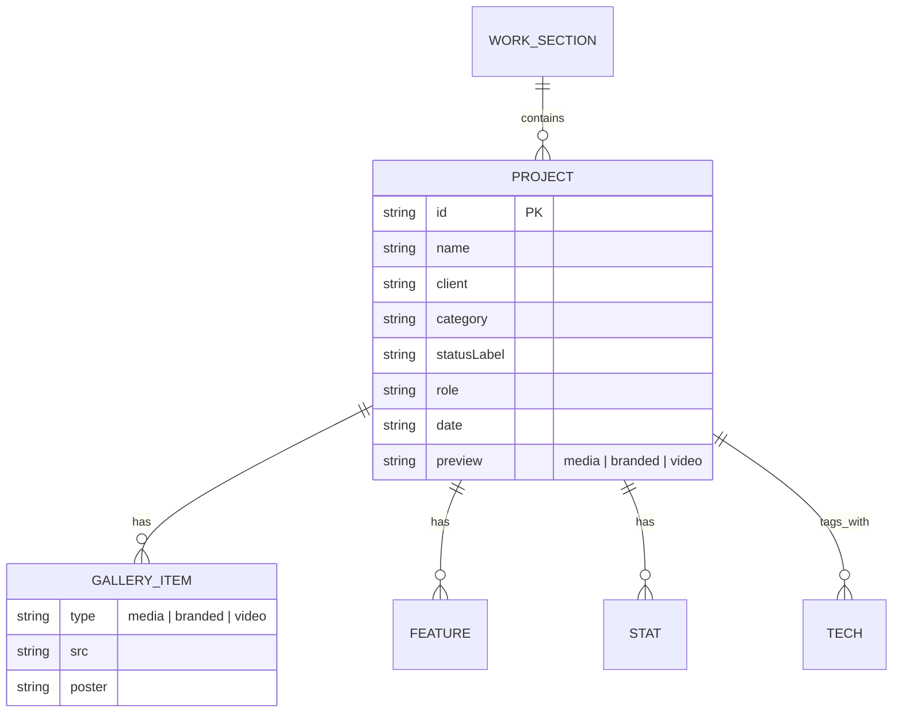

# Database

> TL;DR — **There is no database.** This is a fully static, client-rendered site with zero persistence: no ORM, no migrations, no schemas, no `.env` with connection strings, no server process. Content lives in TypeScript modules compiled into the bundle.

- [What Exists Instead](#what-exists-instead)
- [Where Data Actually Lives](#where-data-actually-lives)
- [Data "Schema" (TypeScript as the contract)](#data-schema-typescript-as-the-contract)
- [Migration Strategy](#migration-strategy)
- [What a Real Database Would Look Like Here](#what-a-real-database-would-look-like-here)

---

## What Exists Instead

| Traditional DB concern | This project's answer |
|---|---|
| Tables / collections | Typed arrays in `src/data/*.ts` |
| Schema | `src/types/index.ts` interfaces |
| Migrations | None needed — content is code, versioned by git |
| Queries | Compile-time imports; React maps over arrays |
| Indexes | N/A (in-memory, single document) |
| Backups | Git history |
| Hosting | Bundled into `dist/` at build time |

---

## Where Data Actually Lives

```text
src/data/
├── portfolio.ts   # 5 projects across 2 sections (the "projects table")
├── timeline.ts    # 1 career chapter item (the "career table")
└── brands.ts      # tech slug + color lookups (the "brands dictionary")
```

### Entity map



This is a logical ER map only — none of these are stored anywhere; they are TypeScript object literals.

---

## Data "Schema" (TypeScript as the contract)

The authoritative schema is `src/types/index.ts`. It exports:

- `Project` / `WorkSection` — the projects content model
- `Visual` / `ProjectVideo` — the media union
- `Cta` — action button union (`link` | `modal`)
- `TimelineItem` — career chapter
- `ProjectStatus`, `ProjectCategory` — literal unions that give autocomplete + exhaustiveness

**Why this design:** every consumer (card, modal, gallery, cube offset, browser-frame URL) reads the same object. TypeScript guarantees that a content edit can't silently break a renderer at build time (`tsc -b` fails the build on type errors).

---

## Migration Strategy

Since content is code, "migrations" are normal git commits:

1. Edit `src/data/portfolio.ts` (add/edit/remove a project object).
2. Drop media into `public/` and reference it by `/filename`.
3. Run `npm run build` — type-check + bundle.
4. Commit & deploy (static host).

If the site ever grows a CMS or a database, the existing `Project` type is the extraction point: swap the static import for a typed fetch (e.g. Supabase Postgres with the same interface), keeping renderers untouched. See [Roadmap in README](../README.md).

---

## What a Real Database Would Look Like Here

If interactivity ever arrives (contact form, blog, analytics, projects-as-a-service), the recommended path is **PostgreSQL via Supabase** (already listed in the owner's "Operate" toolkit in `TechStack.tsx`) with:

- `projects` table mirroring the `Project` type
- `messages` table for contact submissions
- Row Level Security for any auth-needing features
- Supabase JS client + typed generics to keep the current component contract intact

> Next: [Deployment](deployment.md) · [Back to README](../README.md)